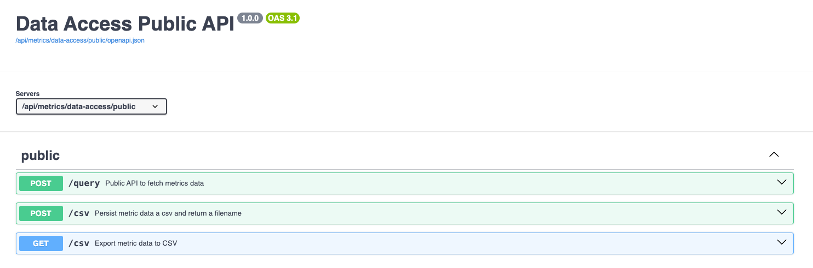

Exporting Data Using Nasdaq Metrio™ REST API
============================================

Updated November 26, 2025 14:31

The Nasdaq Metrio Public API allows you to programmatically export a JSON or CSV file from an existing metric within your Nasdaq Metrio account. This document provides comprehensive information on authentication, endpoints, request formats, and examples to help you integrate your systems seamlessly.

1. Authentication
=================

Before using the Nasdaq Metrio API, you need to generate an API key within your Nasdaq Metrio account.

### Prerequisites

Ensure that the Nasdaq Metrio REST API feature is activated in your account.

### Key Generation

1. Click on your profile icon in the top-right corner of the page.
2. Select API Keys.
3. Click Generate new key.
4. Give your key a descriptive name (e.g., "Project X Integration").
5. Click Generate key.

**Important: Copy the generated API key immediately. You will not be able to retrieve it again.**

### Key Management

You can create multiple API keys to organize your projects and track usage.  
Currently, API keys do not have expiration dates. Please manage your keys securely and regenerate them if you suspect any compromise.

### Security Best Practices

* Treat your API key like a password. Keep it confidential.
* Do not embed API keys directly in client-side code (e.g., JavaScript).
* If you suspect your API key has been compromised, immediately regenerate it.

|  |  |
| --- | --- |
|  |  |

2. JSON export
==============

This section describes how to export your metric's data in a JSON format using the API.

### Header

API endpoints expect arguments as JSON-encoded objects in the POST request body. Set the Content-Type header to application/json.

|  |  |
| --- | --- |
| **HTTP Header** | **Content** |
| Content-Type | application/json |
| X-Metrio-API-Key | <**your\_api\_key**> |
| X-Page | The number of pages. Default to 2. |
| X-Per-Page | The number of elements per page. Default to 3. Note the maximum per\_page parameter is 10000. |

### Endpoint

```
POST https://<customer>.metrio.net/api/metrics/data-access/public/v1/query
```

* Replace <**customer**> with the URL prefix of your account (e.g., "demo123" if your account URL is <https://demo123.metrio.net)>.

### Payload details

```
{
"metric_key": "metric_id",
"filters": [{"column_key": "column_key_to_filter", "values": ["value_key_to_filter"]}],
"sorting": [{"column_key":"column_key_to_sort", "order": "desc"}],
"locale": "local"
}
```

|  |  |  |  |
| --- | --- | --- | --- |
| **Parameter** | **Description** | **Mandatory** | **Type** |
| metric\_key | This is the id of the metric for which we want to create a query. | Yes | string |
| filters | An array of filter objects. Each filter object specifies a column to filter on and the values to match. By default is an empty list []. | No | array |
| * column\_key | The key of the column to filter. | Yes | string |
| * values | An array of values to filter for. The column will be filtered to only include rows where the column\_key matches one of the values in this array. | Yes | array |
| sorting | An array of sorting objects. Each sorting object specifies a column to sort by and the sort order. Note that it allows for multi-sorting. By default is an empty list []. | No | array |
| * column\_key | The key of the column to sort by. | Yes | string |
| * order | The sort order. Valid values are "asc" (ascending) and "desc" (descending). | Yes | string |
| locale | The locale to use for formatting the data. Defaults to "en" if not specified. Could be "fr", "es", etc depending locales available in your account. | No | string |

### Response Codes

|  |  |  |
| --- | --- | --- |
| **Code** | **Description** |  |
| **200** | **Successful Response** | The request was successfully submitted. |
| **422** | **Validation Error** | The request contained invalid data. |
| **500** | **Internal Server Error** | An unexpected error occurred on the server. |

### Request Limits

You are limited to **100 submissions every 10 seconds**. Exceeding this limit may result in temporary throttling.

### Parameters Definition

To use the API to export Metrics' data, a metric needs to be created. Once created, to use the API export functionality, the following parameter needs to be defined:

* <**customer**> : The URL prefix of your account (e.g., "demo123" if your account URL is https://demo123.metrio.net).
* <**metric\_key**>: The Metric ID of the target Metric. You can find this value in the "General Information Section" the Metric within Nasdaq Metrio. It's labeled "Metric ID".

You can copy the key by hovering the `Metric ID` field.

### Example

* Swagger

You can access and test the API using our Swagger UI:

```
https://<customer>.metrio.net/api/metrics/data-access/public/docs#/
```

* + Replace <**customer**> with your account's URL prefix.
  + **You must be logged in** to your Nasdaq Metrio account to access the Swagger UI.



* Curl

```
INPUT:

curl -X 'POST' \                                                     
  'https://{client}.metrio.net/api/metrics/data-access/public/v1/query' \
  -H 'X-Page: 1' \
  -H 'X-Per-Page: 10' \
  -H 'X-Metrio-API-Key: APIKeyValue' \
  -H 'Content-Type: application/json' \
  -d '{
  "metric_key": "packages_ghgtool_metric_consumption_global_monthly",
  "filters": [{"column_key": "tag_facility_id", "values": ["facility_0007"]}],
  "sorting": [{"column_key":"date", "order": "desc"}],
  "locale": "en"
}'
```

```
OUTPUT:

{
  "metadata": {
    "per_page": 10,
    "page": 1,
    "total_count": 6362,
    "total_page": 637
  },
  "headers": [
    {"id": "date", "type": "date", "name": "Date"},
    {"id": "tag_facility_id", "type": "string", "name": "Facility ID"},
    {"id": "meta_country", "type": "string", "name": "Country"},
    {"id": "tag_unit", "type": "string", "name": "Unit"},
    {"id": "value", "type": "number", "name": "Main Value: Consumption (in unit)"}
  ],
  "data": [
    [
      {"id": "date", "value": "2024-12-01 00:00:00.000000000", "localized_value": "2024-12"},
      {"id": "tag_facility_id", "value": "facility_0007", "localized_value": "New York City"},
      {"id": "meta_country", "value": "USA", "localized_value": "United States"},
      {"id": "tag_unit", "value": "kwh", "localized_value": "kWh"},
      {"id": "value", "value": 222.73404164950054, "localized_value": "222.73404164950054"}
    ],
    [
      {"id": "date", "value": "2024-11-01 00:00:00.000000000", "localized_value": "2024-12"},
      {"id": "tag_facility_id", "value": "facility_0007", "localized_value": "Los Angeles"},
      {"id": "meta_country", "value": "USA", "localized_value": "United States"},
      {"id": "tag_unit", "value": "kwh", "localized_value": "kWh"},
      {"id": "value", "value": 123.456789, "localized_value": "123.456789"}
    ]
  ]
}
```

### 

* Python

```
import json
import os
import requests
import pandas as pd
import logging

# Configure logging
logging.basicConfig(level=logging.INFO, format='%(asctime)s - %(levelname)s - %(message)s')

customer = "_YOUR_CLIENT_URL_PREFIX_"         # client URL prefix, ex: demo
KeyValue = "_YOUR_API_KEY_"                   # Paste a valid Metrio API key
metric_id = "_METRIC_ID_"                   # Metric ID of the metrics
per_page = "10000"


# Optional parameters
filters = []
# filters = [{"column_key": "tag_facility_id", "values": ["facility_0007"]}]
sorting = []
# sorting = [{"column_key": "date", "order": "desc"}]
locale = "en"


headers = {
    'X-Metrio-API-Key': KeyValue,
    'X-Per-Page': per_page,
    "Content-Type": "application/json"
}

def fetch_page_data(session, page):
    try:
        response = session.post(
            f'https://{customer}.metrio.net/api/metrics/data-access/public/v1/query',
            headers={
                'accept': 'application/json',
                'X-Page': str(page),
                'X-Per-Page': per_page,
                'X-Metrio-API-Key': KeyValue,
                'Content-Type': 'application/json'
            },
            data=json.dumps({
                "metric_key": metric_id,
                "filters": filters,
                "sorting": sorting,
                "locale": locale
            })
        )
        response.raise_for_status()
        return response.json().get('data', [])
    except requests.exceptions.RequestException as e:
        logging.error(f"Error fetching data for page {page}: {e}")
        return []

def fetch_initial_data(session):
    try:
        response = session.post(
            f'https://{customer}.metrio.net/api/metrics/data-access/public/query',
            headers=headers,
            data=json.dumps({
                "metric_key": metric_id,
                "filters": filters,
                "sorting": sorting,
                "locale": locale
            })
        )
        response.raise_for_status()
        return response.json()
    except requests.exceptions.RequestException as e:
        logging.error(f"Error fetching initial data: {e}")
        return None

def save_to_json(data, filename='output.json'):
    with open(filename, 'w') as f:
        json.dump(data, f)
    logging.info(f"Data saved to {filename}")

def save_to_csv(data, filename='output.csv'):
    rows = []
    for item in data:
        row = {entry['id']: entry['value'] for entry in item}
        rows.append(row)
    df = pd.DataFrame(rows)
    df.to_csv(filename, index=False)
    logging.info(f"Data saved to {filename}")

def fetch_data():
    data = []

    with requests.Session() as session:
        initial_data = fetch_initial_data(session)
        if not initial_data:
            return

        try:
            total_page = initial_data['metadata']['total_page']
            total_count = initial_data['metadata']['total_count']
            logging.info(f"Total pages: {total_page}")
            logging.info(f"Total rows: {total_count}")
        except KeyError as e:
            logging.error(f"Error: {e} not found in response metadata")
            return

        total_fetched = 0

        for page in range(1, total_page + 1):
            page_data = fetch_page_data(session, page)
            data.extend(page_data)
            total_fetched += len(page_data)
            percentage = (total_fetched / total_count) * 100
            logging.info(f"Fetched page {page}: {len(page_data)} records ({percentage:.2f}% of total)")

    save_to_json(data)
    save_to_csv(data)

if __name__ == "__main__":
    fetch_data()
```

|  |  |
| --- | --- |
|  |  |

3. CSV export
=============

This section describes how to export data tables from Metrio metrics in CSV format. It uses a two-step process: first, you request a data export, and then you retrieve the generated CSV file.

3.1. Request Data Export (POST)
-------------------------------

This endpoint initiates the process of exporting data for a specific metric.

### Header

API endpoints expect arguments as JSON-encoded objects in the POST request body. Set the Content-Type header to application/json.

|  |  |
| --- | --- |
| **HTTP Header** | **Content** |
| Content-Type | application/json |
| X-Metrio-API-Key | <**your\_api\_key**> |

### Endpoint

```
POST https://<customer>.metrio.net/api/metrics/data-access/public/v1/csv
```

* Replace <**customer**> with the URL prefix of your account (e.g., "demo123" if your account URL is <https://demo123.metrio.net)>.

### Payload details

```
{
"metric_key": "metric_id",
"filters": [{"column_key": "column_key_to_filter", "values: ["value_key_to_filter"]}],
"sorting": [{"column_key":"column_key_to_sort", "order": "desc"}],
"locale": "local"
}
```

|  |  |  |  |
| --- | --- | --- | --- |
| **Parameter** | **Description** | **Mandatory** | **Type** |
| metric\_key | This is the id of the metric for which we want to create a query. | Yes | string |
| filters | An array of filter objects. Each filter object specifies a column to filter on and the values to match. By default is an empty list []. | No | array |
| * column\_key | The key of the column to filter. | Yes | string |
| * values | An array of values to filter for. The column will be filtered to only include rows where the column\_key matches one of the values in this array. | Yes | array |
| sorting | An array of sorting objects. Each sorting object specifies a column to sort by and the sort order. Note that it allows for multi-sorting. By default is an empty list []. | No | array |
| * column\_key | The key of the column to sort by. | Yes | string |
| * order | The sort order. Valid values are "asc" (ascending) and "desc" (descending). | Yes | string |
| locale | The locale to use for formatting the data. Defaults to "en" if not specified. Could be "fr", "es", etc depending locales available in your account. | No | string |

### Response Codes

|  |  |  |
| --- | --- | --- |
| **Code** | **Description** |  |
| **200** | **Successful Response** | The request was successfully submitted. |
| **422** | **Validation Error** | The request contained invalid data. |
| **500** | **Internal Server Error** | An unexpected error occurred on the server. |

### Request Limits

You are limited to **100 submissions every 10 seconds**. Exceeding this limit may result in temporary throttling.

### Parameters Definition

To use the API to export Metrics' data, a metric needs to be created. Once created, to use the API export functionality, the following parameter needs to be defined:

* <**customer**> : The URL prefix of your account (e.g., "demo123" if your account URL is https://demo123.metrio.net).
* <**metric\_key**>: The Metric ID of the target Metric. You can find this value in the "General Information Section" the Metric within Nasdaq Metrio. It's labeled "Metric ID".


You can copy the key by hovering the `Metric ID` field.

### Example

* Swagger

You can access and test the API using our Swagger UI:

```
https://<customer>.metrio.netapi/metrics/data-access/public/docs#/
```

* + Replace <**customer**> with your account's URL prefix.
  + **You must be logged in** to your Nasdaq Metrio account to access the Swagger UI.


* Curl

```
INPUT:

curl -X 'POST' \                                                     
  'https://{client}.metrio.net/api/metrics/data-access/public/v1/csv' \
  -H 'X-Page: 1' \
  -H 'X-Per-Page: 10' \
  -H 'X-Metrio-API-Key: APIKeyValue' \
  -H 'Content-Type: application/json' \
  -d '{
  "metric_key": "packages_ghgtool_metric_consumption_global_monthly",
  "filters": [{"column_key": "tag_facility_id", "values: ["facility_0007"]}],
  "sorting": [{"column_key":"date", "order": "desc"}],
  "locale": "en"
}'
```

```
OUTPUT:
{
"filename": "packages_ghgtool_metric_consumption_global_monthly_20250408174053",
"success": true,
"num_rows": 10,
"execution_time": 1.37746262550354
}
```

Now we will be able to get the file generated.

3.2. Get Data File (GET)
------------------------

This endpoint retrieves the CSV file that was generated by the previous POST request.

### Header

API endpoints expect arguments as JSON-encoded objects in the POST request body. Set the Content-Type header to application/json.

|  |  |
| --- | --- |
| **HTTP Header** | **Content** |
| X-Metrio-API-Key | <**your\_api\_key**> |

### Endpoint

```
GET https://<customer>.metrio.net/api/metrics/data-access/public/v1/csv?<filename>
```

* Replace <**customer**> with the URL prefix of your account (e.g., "demo123" if your account URL is <https://demo123.metrio.net)>.
* Replace <**filename**> with the value obtained from the response of the POST request.

### Response Codes

|  |  |  |
| --- | --- | --- |
| **Code** | **Description** |  |
| **200** | **Successful Response** | The request was successfully submitted. |
| **422** | **Validation Error** | The request contained invalid data. |
| **500** | **Internal Server Error** | An unexpected error occurred on the server. |

### Request Limits

You are limited to **100 submissions every 10 seconds**. Exceeding this limit may result in temporary throttling.

### Example

* Swagger

You can access and test the API using our Swagger UI:

```
https://<customer>.metrio.netapi/metrics/data-access/public/docs#/
```

* + Replace <**customer**> with your account's URL prefix.
  + **You must be logged in** to your Nasdaq Metrio account to access the Swagger UI.


* Curl

```
INPUT:

curl -X 'GET' \
'https://products.metrio.net/api/metrics/data-access/public/v1/csv?filename=packages_ghgtool_metric_consumption_global_monthly_20250408174053' \
-H 'accept: */*'
```

3.3. Example usage
------------------

* Python

```
import json
import logging
import requests
from termcolor import colored
import time

customer = "_YOUR_CLIENT_URL_PREFIX_"  # client URL prefix, ex: demo
your_api_key = "_YOUR_API_KEY_"  # Paste a valid Metrio API
metric_keys_to_get = [
    "_METRIC_ID_1",
    "_METRIC_ID_2"
]

api_endpoint_upload_csv = f"https://{customer}.metrio.net/api/metrics/data-access/public/v1/csv"
api_endpoint_get_csv = f"https://{customer}.metrio.net/api/metrics/data-access/public/v1/csv"

# Configure the headers
headers = {
    'Content-Type': 'application/json',
    "X-Metrio-API-Key": your_api_key
}
filters = []
sorting = []
locale = "en"

# Configure logging
logging.basicConfig(level=logging.INFO)
log = logging.getLogger(__name__)

# List to track failed metrics
failed_metrics = []

def send_post_request(metric_key):
    # Prepare the payload for the POST request
    payload = {
        "metric_key": metric_key,
        "filters": filters,
        "sorting": sorting,
        "locale": locale
    }

    # Send the POST request
    response = requests.post(api_endpoint_upload_csv, headers=headers, data=json.dumps(payload))

    if response.status_code == 200:
        response_data = response.json()
        filename_for_csv = response_data.get("filename")
        if filename_for_csv:
            print(f"POST request successful for metric '{metric_key}'. Filename: {filename_for_csv}")
            return filename_for_csv
        else:
            error_message = f"POST request successful but no filename returned for metric '{metric_key}'."
            print(colored(error_message, "red"))
            failed_metrics.append(metric_key)
    else:
        error_message = f"Failed to query the API for metric '{metric_key}'. Status code: {response.status_code}"
        print(colored(error_message, "red"))
        print(colored(f"Response: {response.text}", "red"))
        failed_metrics.append(metric_key)
    return None

def download_the_csv(filename_for_csv, metric_key):
    # Construct the URL to download the CSV
    get_csv_url = f"{api_endpoint_get_csv}?filename={filename_for_csv}"

    # Send a GET request to download the CSV file
    get_csv = requests.get(get_csv_url, headers=headers)

    if get_csv.status_code == 200:
        # Extract the filename from the Content-Disposition header
        content_disposition = get_csv.headers.get("content-disposition", "")
        if "filename=" in content_disposition:
            actual_filename = content_disposition.split("filename=")[-1].strip().strip('"')
        else:
            actual_filename = filename_for_csv

        # Save the CSV file locally
        with open(actual_filename, 'wb') as file:
            file.write(get_csv.content)
        print(f"CSV file '{actual_filename}' downloaded successfully.")
    else:
        error_message = f"Failed to download the CSV for metric '{metric_key}'. Status code: {get_csv.status_code}"
        print(colored(error_message, "red"))
        print(colored(f"Response: {get_csv.text}", "red"))
        failed_metrics.append(metric_key)

def process_metric(metric_key):
    filename = send_post_request(metric_key)
    if filename:
        download_the_csv(filename, metric_key)

# Track total execution time
total_start_time = time.time()

# Process each metric sequentially
for metric_key in metric_keys_to_get:
    process_metric(metric_key)

# Summarize failed metrics at the end
if failed_metrics:
    # Remove duplicates by converting the list to a set
    unique_failed_metrics = set(failed_metrics)
    print(colored("\nThe following metrics failed to process:", "red"))
    for metric in unique_failed_metrics:
        # Create a clickable link for each failed metric
        metric_url = f"https://{customer}.metrio.net/metrics/{metric}"
        print(colored(f"- {metric_url}", "red"))
else:
    print("All metrics processed successfully.")

# Log total execution time
total_end_time = time.time()
total_execution_time = total_end_time - total_start_time
print(f"Total execution time: {total_execution_time:.2f} seconds.")
```