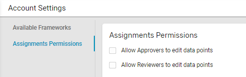

Quick Start Guide for Administrators
====================================

Updated October 20, 2024 18:22

****

**Purpose:** How to begin work in the Framework & Disclosure Management platform.

**Intended Audience:** Customer Administrators (and Owners for some set up)

Navigation: [Login](https://account.nasdaq.com/Login/onereport) >    (bottom of left-hand nav panel) and as specified below

Set up your Nasdaq Metrio™ Framework & Disclosure Management account

1) Decide which of the available frameworks you wish to make active at this point. By default, all regulatory and voluntary frameworks available to you will be active.

If you decide to narrow the frameworks visible to your Administrators and Owners:

In the bottom of your left-hand navigation panel, go to Settings   > Framework to turn off > Toggle the slide bar to the left to make that framework inactive. The green indicator will hidden when turned off:

Consider:

* Which frameworks will you address during the reporting cycle?
* Do you want to phase work on different frameworks?
* What is the content update cycle for questions or metrics for frameworks that matter to you?
  + For example, do you wish to hide a framework whose metrics will change to avoid risk of premature or wasted effort?
* If your work will be phased, which frameworks do you want to focus on and assign work now?
* Do you prefer to have all frameworks be visible at all times or narrow the focus based on access and/or assignments?

|  |
| --- |
| Tip Box_v3.png  Making a framework temporarily inactive will remove its visibility for your team to make assignments, see or do work, and create any reports for that reporting year. If any work had been done or assignments made, ALL WORK IS PRESERVED AND AVAILABLE once you re-activate a framework. |

2) Set permissions for all users

In the bottom of your left-hand navigation panel, go to Settings   > Assignments Permissions > Tick the checkboxes that apply for your team:

|  |
| --- |
| Tip Box_v3.png If you do not set these permissions, Approvers and Reviewers will have read-only access and rights to change the status of your work. If you want Approvers or Reviewers to be able to edit rather than simply Approve or Review, you can also set those users up as Contributors with edit permissions. |

If you have questions, discuss considerations with your customer success team.

3) Decide what available roles you want to use, who should have access, framework priorities and schedules, and make your assignments.

Once user roles are properly defined, determine the order in which your team should approach the frameworks, raters, and rankers you may be reporting to. Take into account reporting and submission deadlines.

Assign members of your team to different roles for tasks for different topics and "data requests" depending on how they might best contribute.

4) Take time to become familiar with the layout of the reporting style of the platform. Refer to the Glossary to better understand the components of the platform design (data request, data point, etc.).

5) In advance of your work, decide who will share in the uploading of references into your reference library and naming conventions you wish to use to avoid duplicates.

6) Share any guidance about tone, formatting of data input and responses, especially for narrative text, to minimize the need for edits during the approval and review processes.

7) Once you are satisfied with your reporting, you can explore the options for sharing your data and reports that are available within the platform.