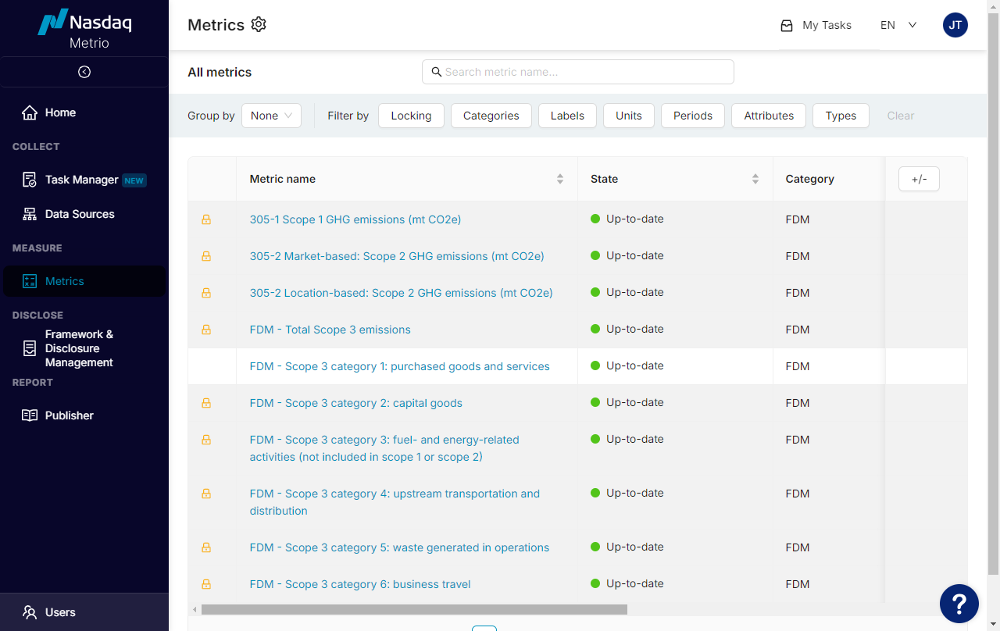

Navigating the List of Metrics
==============================

Updated September 27, 2024 19:24

**Purpose:** How to navigate the list of Metrics.

**Intended Audience:** Administrators

**Navigation:** Login > Home > Metrics

The Metrics index shows all the Metrics available in a company’s SDM account. It is the go-to place for easily managing Metrics and quickly getting information about them.

Clicking on a Metric will open a window to the corresponding Metric’s page.

### Categorization and Filtering Options

Clicking on a Metric will open a window to the corresponding Metric’s page.

To better organize the Metrics index, Metrics can be grouped into categories.

To easily find a specific Metric, the Metrics index offers a variety of filtering options:

* By categories and labels
* By unit and period
* By attributes contained in the Metric’s structure
* By type (simple or advanced)

Additionally, the search bar can be used to search for a Metric by its name or ID.

### Metric Metadata

The Metrics index provides helpful information about the company’s available Metrics, including:

* State: Up-to-date, Out-of-date, Update failed, Never synced
* Locking status: Locked or Unlocked
* Category
* Labels
* Attributes: Number of attributes and attribute names
* Unit
* Period
* Used by Metrics: Number of other Metrics that use the Metric
* Used in Publisher: Number of indicators that use the Metric
* Last edited: Date and time of last edit made