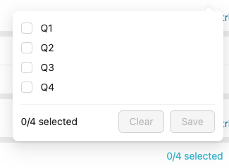

Simple Metrics
==============

Updated January 10, 2025 15:55

**Purpose:** Understanding simple Metrics2

**Intended Audience:** Administrators

**Navigation:** Login > Home > Metrics

Simple Metrics are used for simple operations and can be created, edited, and deleted by any entitled user. The operations that can be performed by simple Metrics include:

* Reorganizing or deleting attributes.
* Filtering output data by existing values in an input source.
* Setting aggregation methods.

These operations can be performed on Data Sources or other existing simple or advanced Metrics.

**Creating a Simple Metric**
----------------------------

In Nasdaq Metrio, the only type of metric that can be created and managed by the end-user is simple metric. To know more about simple metrics, please read the [Simple vs advanced metric](/hc/en-us/articles/23003583655707) article.

You can create one or more simple metrics from data sources or other metrics.

1. Access to the Metric Builder
-------------------------------

The "New metrics" button located on the upper-right corner of the index opens a modal that proposes two options. "Create simple metrics" is the option to choose. Note that you need admin rights to be able to perform this action.

2. Select input sources
-----------------------

In the input sources selector screen, all input sources that are available to be turned into a new metric are listed.

They are grouped in 3 different lists which each gather an input source type:

* Metrics (simple, advanced or even locked)
* Data sources
* Data sources (legacy) - only applicable if Metrio legacy is used

A search bar can help to find in each list input sources by their name.

Additionally, filters (category, period, unit, labels and attributes, depending on the type of the input) can be used.

Multiple sources can be selected. Each input source you select will create a new metric that will be customizable in the next screen.

Multiple instances of the same input sources can be selected in order to create multiple metrics from the same input source.

Once the selection of input sources is done, clicking on "Set up X metrics" button in the top right corner of the screen.

At any moment, the process can be stopped by clicking on "Cancel", but all ongoing selection or customization will be lost.

3. Set up metric(s)
-------------------

Once the selection is done, the next step will be to set up the future metrics. "Set up metrics" screen can be divided in two: the selected input sources's instance(s) panel on the left and the metrics builder on the right.

### a. The selected input sources's instance(s) panel

On the left, this panel shows the input sources' instance(s) selected in the previous screen.

It's always possible to remove instances or groups of instances by clicking on the remove icon.

In order to speed-up the metric creation process, individual instances can be duplicated. The duplicated instance will keep the same parameters as the original, including those which were modified. This is especially handy for creating several different metrics with slightly different configurations from the same input source.

### b. The Metric Builder

The right part of the screen is where the customization of the selected instance takes place. The Metric Builder can be divided in two sections:

* The "Identify" section on the left features the metric's name, ID, unit, category and label(s)

* Both the metric name and metric ID are required. A unit must be specified too.

* The "Customize" section displays the structure of the instance. It has 4 boxes in which attributes can be added (with drag and drop or by using "Add attributes"):

* The "Period attributes" box contains the attributes that define the periodicity (period-type attributes; i.e. year, half year, quarter, month and date) of the metric that will be created. This box cannot be left empty
* The "Structure attributes" box contains all attributes that are not period or primary attributes
* The "Metric attributes" box contains can only contain number-type attributes. An aggregation method can be set. This box cannot be left empty.

* The "Filters" box contains the attributes you want the metric to be filtered with. Once an attribute is put in the filters box, its values can be selected.

The structure can be edited by changing the order or removing attributes, just like in a pivot table. If following the removal of an attribute a loss of granularity occurs, an aggregation method can be set for the primary attribute.

Clicking "Reset all" button located in the upper right corner of the section will undo all modifications and reset the original input source's structure.

4. Verify and create
--------------------

All instances in the list must be set up properly before being created as metrics. All instances must have:

* a name in the account's primary language
* a unique metric ID, even for instances that come from the same input source.
* a unit

Omitting to provide these information will result in errors that must be fixed before going further.

Once every instances are properly set up, clicking on the "Create X metrics" button (located in the top right corner of the screen) will turn them into actual ready-to-use metrics. You will find them in the metrics index.