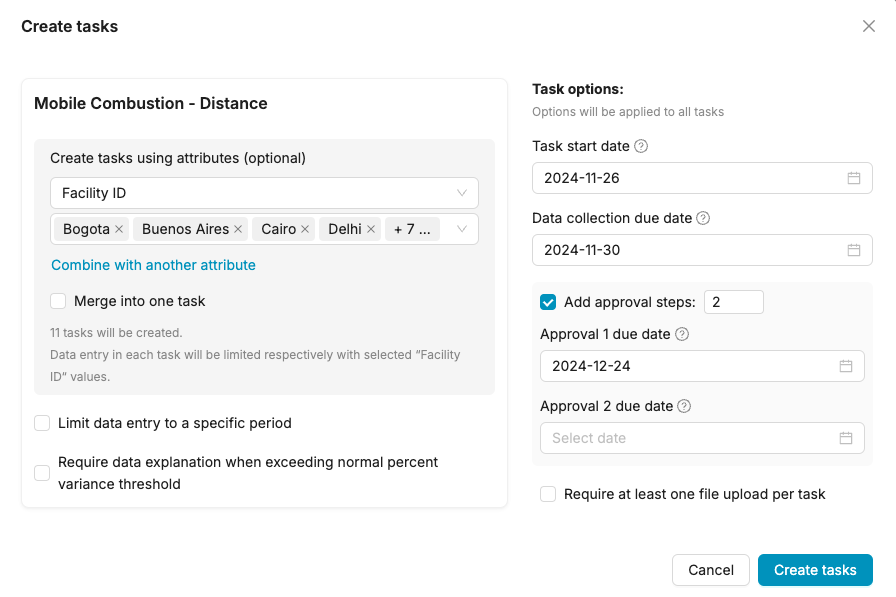
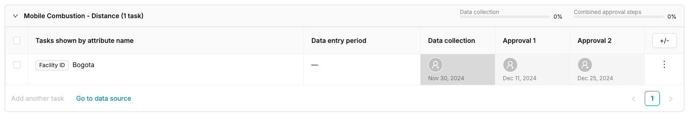
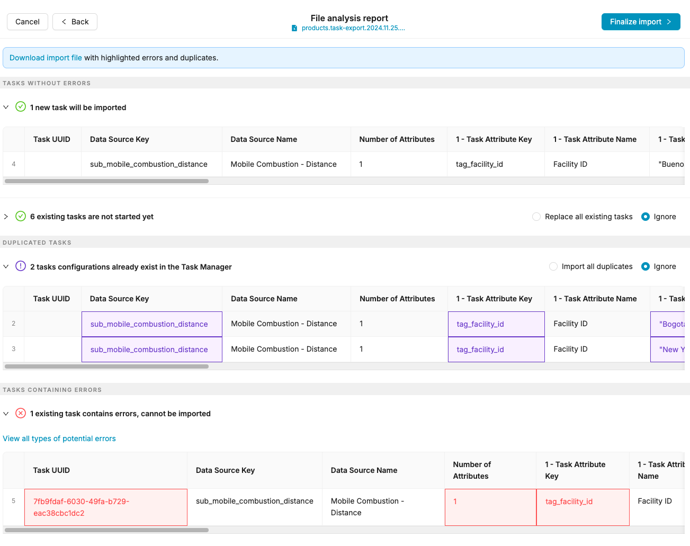
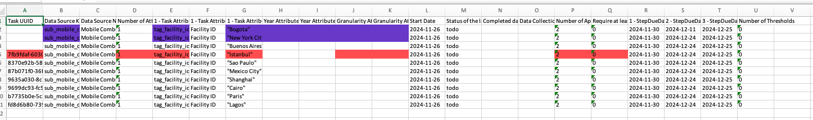
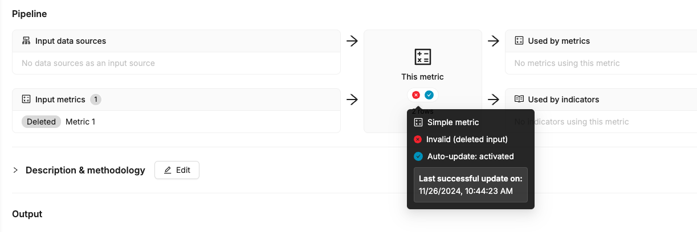
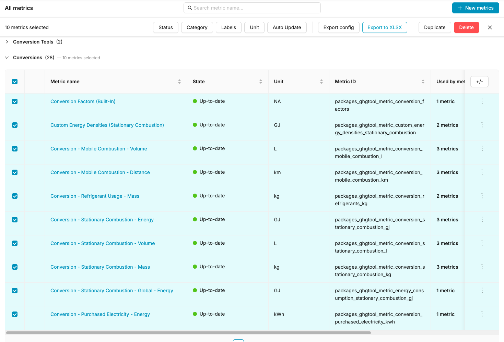
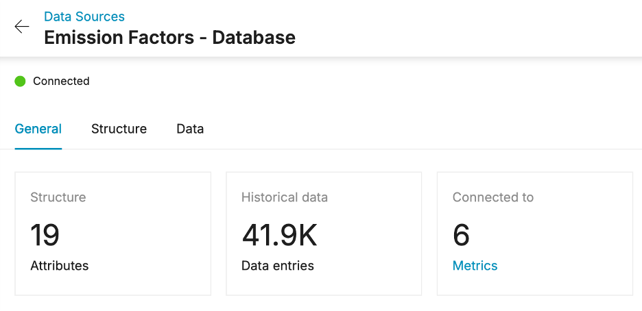
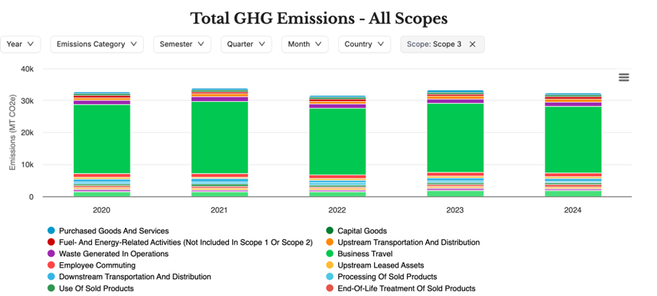

[23-11-24] 4.7 Release Notes
============================

Updated November 26, 2024 21:29

Data Source
===========

Task Manager - set specific due date for each step
--------------------------------------------------

You can now set different due dates for each step within a task, allowing for finer-grained control over your project timelines. This includes steps such as Data Collection, Approval 1, Approval 2, and any other custom steps you define.

Once set, all due dates will be clearly visible in both the Task Manager and your My Tasks view.

Automated email reminders for task step due dates
-------------------------------------------------

* A notification email is sent to the data collector on the task's start date;
* Three days prior to each step's due date, a reminder email is sent to all assignees of that step;
* If a step's due date is exceeded, a daily reminder email will be sent to all assignees of that step and for a maximum of 30 days.

Note: Following user feedback, email notifications will no longer be sent to task creators.

Task Manager - create or update tasks using Excel import
--------------------------------------------------------

We have introduced a new feature allowing users to import or update tasks from an Excel spreadsheet. This streamlined process supports bulk task creation and modification, significantly improving efficiency.

Once the file is uploaded, a flow similar to the data upload in a data source will be displayed.

The Excel import feature now provides a downloadable file highlighting errors and duplicate entries, simplifying troubleshooting. This functionality will be added to the data import feature in a future release.

---

Metrics
=======

New version of the Topology view
--------------------------------

The new version of the Topology is available for all users who already have access to the Metrics module. This new version includes:

* Separation by content type: data source vs metrics vs indicators
* Live status of the metrics (up-to-date (green), out-of-date (orange), etc.)
* Possibility to search a specific objects (tag/list, data source, metric and indicator) and focus on their specific relations

Topology_search.gif
-------------------

More info in the pipeline - Deleted input
-----------------------------------------

You can now see in the pipeline view more contextual information regarding why your metric is invalid.

Metric deletion warning
-----------------------

To prevent accidental losses, we're making it harder to delete a metric.

Screenshot 2024-11-26 at 10.44.47 AM.png
----------------------------------------

Export Metrics informations in Excel
------------------------------------

Select the metrics you need, and export all the information shown in the current view in a Excel file.

Customer can now create and manage simple metrics (BETA)
--------------------------------------------------------

We're pleased to announce a beta feature enabling customers to create and manage simple metrics. This feature requires activation on a customer-by-customer basis. Once enabled, all users with access to the Metrics module will have the capability to create, update, and delete metrics. Please contact the product team if you would like to have this feature activated on your account.

Screenshot 2024-11-26 at 10.55.15 AM.png
----------------------------------------

---

Template: CAM (Carbon Accounting Manager)
=========================================

New mapping management
----------------------

Unified mapping between Activity Data and Emission Factors across all Scopes 1, 2 and 3 for a simplified workflow.

Climatiq version 17.17
----------------------

Integration of the version 17.17 of Climatiq Database that includes 41.9K entries.

For more details about this new version and the changelog, consult [Climatiq website](https://www.climatiq.io/docs/changelogs/data-version/data-release-17).

New Scope 3 categories
----------------------

Addition of detailed categories: **4,5, 7, and 9.**

Scope 3 categories 1, 2, 4, 5, 6, 7, 9 and 15 are now included in the tool. There is also the possibility to enter direct CO2e emissions for all other categories.

