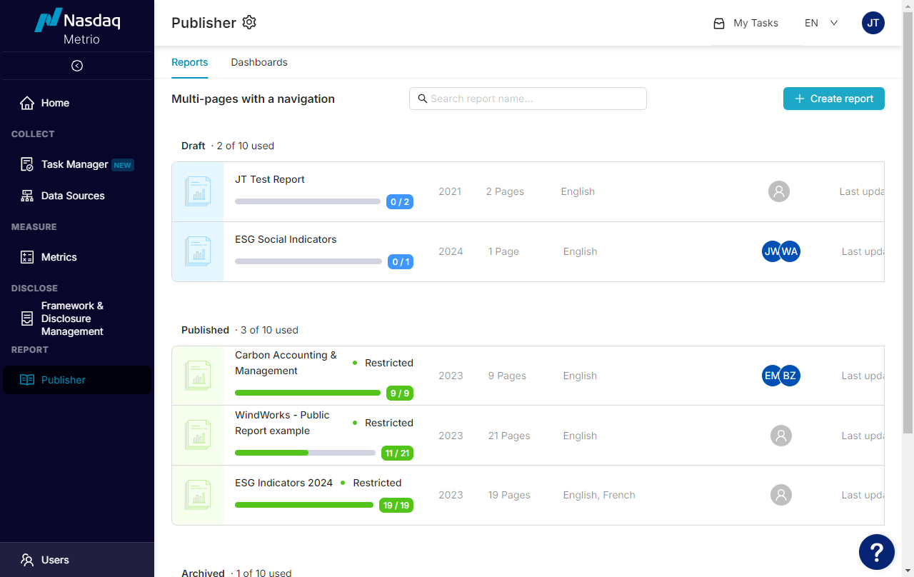
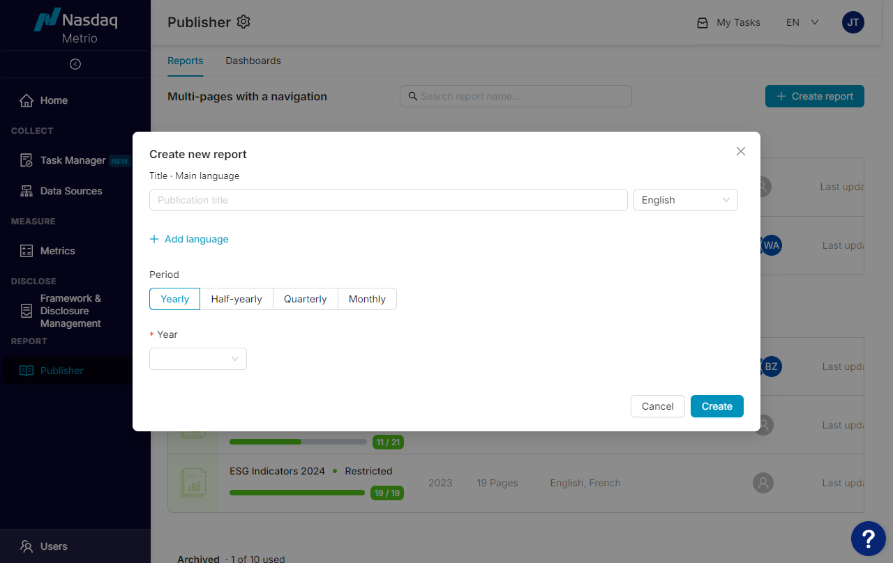
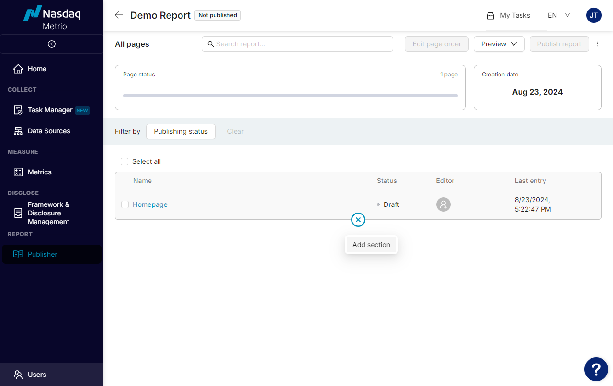
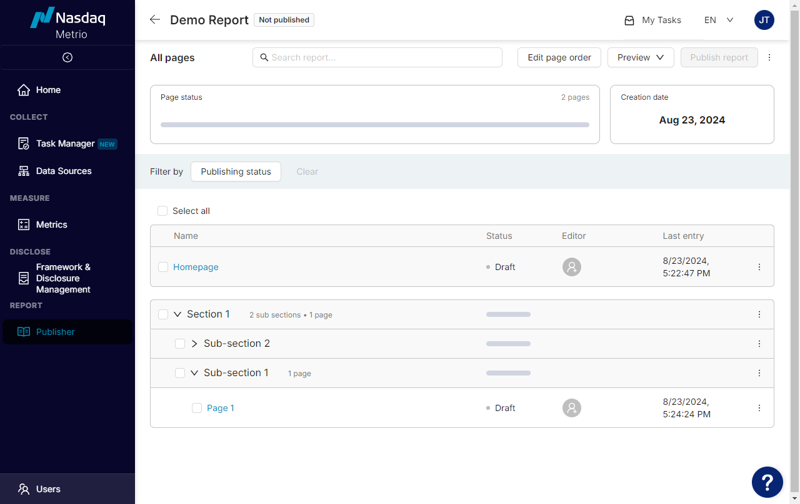
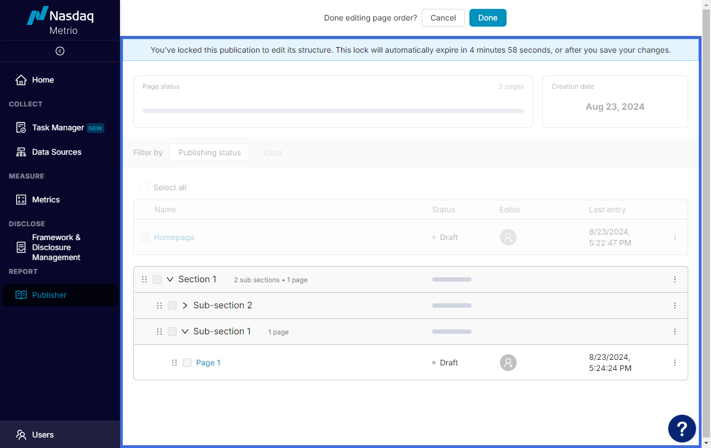

Create a Report in Publisher
============================

Updated January 28, 2025 20:42

### Create a new report

Click **Create** report in the Reports tab to create a report draft.

Enter the following information and click **Create** when all required fields are appropriately entered:

* Publication title (required)
* Main language: Reports can be published in English, French, German, Italian, Portuguese, and/or Spanish
* Additional languages: Multiple additional languages can be added by clicking **Add language**
* Report period
* Year (required)

### Structure the report

Now the report structure can be set. The report structure window includes:

* Report sections
* Report sub-sections
* Report pages
* Status of sections, sub-sections, pages
* Creation information
* Page status: Number of pages in the report and a summary of pages that are in the Draft, Ready, and Publish stage

The **Homepage** will always appear as the first page in the report structure. The position of the Homepage in the report cannot be changed.

Hover between report elements and click **(+)** to add additional report elements. When creating a new report, the first thing that must be added is a section.

Click **(+)** under an existing report element to add nested elements or additional, separate sections.\*\* Repeat until the desired layout of sections, sub-sections, and pages has been created.

\*\* Sections cannot contain other sections, and sub-sections cannot contain other sub-sections. Sub-sections are optional, as pages can be nested directly under sections.

Click **Edit page order** in the top right of the window to edit the report structure.

The report will be locked to other users until the editor is finished editing. Grab the dots icon **(****⋮****)** to the left of a report element to move sections, sub-sections, or pages within the report.

Drag and drop the element into the desired location. Pages can be moved from one sub-section or section to another. The indent of the dashed box will indicate where the element will land.

Click **Done** at the top of the window to save any changes and unlock for to continue to work on your report.

### Manage the report

Click the three dots **(More)** **⋮**  in the top right of the report structure window to edit the report as a whole.

* **Edit report:** Edit report title, main language, additional languages, and report period. To edit report contents, see further guidance below.
* **Copy link:** Generate a link to the entire report.
* **Export PDF:** Export the entire report to PDF.
* **Archive:** Archive the entire report. This option is only available once the report is published, and once selected, this action cannot be undone. A link can be generated for the archived report, but the link can only be opened in a browser that is logged into an SDM account. Archived reports can also be exported to PDF and deleted but cannot be unpublished.
* **Delete:** Delete the entire report.
* **Publish**/**Unpublish:** will be covered in **[Publish a Report](/hc/en-us/articles/29100866928667-Publish-a-Report)**.

### Manage a section, a subsection or a page

Click the three dots **(More)** **⋮**at the right of any individual report element’s row in the report structure window to edit that specific element.

* **Set as ready:** Set the selected item to “Ready” status (only visible on the page-level).
* **Export PDF:** Export the selected item to PDF. If exporting from the section or sub-section level, all sub-items will also be exported.
* **Preview:** Generate a preview of the selected item. If generating a preview from the section or sub-section level, all sub-items will also be included in the preview.
* **Copy link:** Generate a link to the selected item. If generating a link from the section or sub-section level, all sub-items will also be included in the generated link.
* **Delete:** Delete the selected item. If deleting from the section or sub-section level, all sub-items will also be deleted.

### Preview the report

After developing and editing a report, a preview can be generated to visualize the published report, which is very similar to that of a website. Click **Preview** in the top right of the window to generate a preview of the report.

* **Preview all pages:** Generate a preview of the report with all existing sections, sub-sections, and pages. Click *Copy link* to generate a link to a preview of the entire report. This link will be available for use by any company SDM user that is logged into their account and who has access to the Publisher module.
* **Preview “Ready” pages only:** Generate a preview of the report with all sections, sub-sections, and pages whose status is “Ready”.

### Interactive Video Demo:

* [Create a Report Draft in Publisher](https://nasdaq-cs.storylane.io/share/dcnazfremtbg)